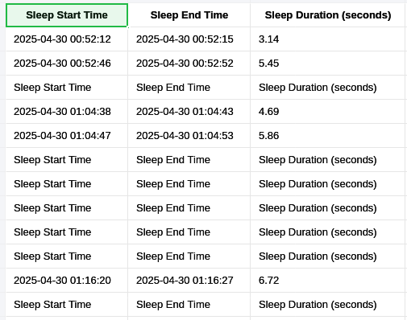

# Driver Drowsiness Detection System

## Project Overview

This system detects drowsiness in drivers using a live webcam feed. The system analyzes eye movement to determine whether the driver’s eyes are closed for a prolonged period and alerts the driver with a sound when drowsiness is detected.

## Key Features:

- **Eye Aspect Ratio (EAR)**: Detects closed eyes by analyzing facial landmarks.
- **Real-time video feed processing**: Uses the webcam feed to monitor the driver.
- **Sound Alerts**: Provides audio feedback when drowsiness is detected.
- **Visual Feedback**: Displays a "WARNING" or "ALERT: WAKE UP!" message when the driver’s eyes are closed for too long.
- **Logging**: Records the start and end of sleep periods and generates sleep duration analysis.

## Preprocessing:

- **Horizontal Flip**: Mirrors the image to ensure the face is captured correctly.
- **Color Conversion**: Converts the frame from BGR to RGB for MediaPipe processing.
- **Gaussian Blur**: Reduces noise in the frame for better detection.

## Feature Detection:

- **Face and Eye Landmarks**: Detected using the MediaPipe Face Mesh model.
- **Eye Aspect Ratio (EAR)**: A metric used to determine whether the driver’s eyes are closed for too long.

## Workflow:

1. **Capture Webcam Feed**: A live video stream from the webcam is captured.
2. **Face and Eye Landmark Detection**: Detect the driver’s face and eyes using MediaPipe.
3. **EAR Calculation**: Calculate the Eye Aspect Ratio (EAR) to detect closed eyes.
4. **Alert System**: If the EAR falls below a threshold, a warning or alert sound is played.
5. **Logging Sleep Periods**: The start and end of drowsy periods are logged to a CSV file.
6. **Visualization**: Displays the processed video feed with annotations showing:
   - Eye rectangles
   - Face bounding box
   - Alert messages

## CSV Logging:

The system logs the sleep periods in a CSV file (`sleep_log.csv`). The log includes:

- **Sleep Start Time**
- **Sleep End Time**
- **Sleep Duration (in seconds)**

## Output:

- **Real-time Alert**: Audio and visual feedback when drowsiness is detected.
- **Saved Image**: When an alert occurs, a snapshot of the drowsy face is saved with a timestamp.
- **Sleep Duration Plot**: At the end of the session, a plot of the sleep periods is saved as `detailed_analysis.png`.

## Thresholds:

- **Eye Closed Threshold**: The Eye Aspect Ratio (EAR) threshold is set to `0.25`. If the EAR falls below this value, the eyes are considered closed.
- **Warning Time**: 3 seconds of eye closure before a warning is issued.
- **Alert Time**: 5 seconds of eye closure before an alert is issued.

## Interactive UI:

- **ESC Key**: Press "ESC" to exit the session.
- **Real-time Feedback**: Displays "WARNING" or "ALERT: WAKE UP!" on the video feed.
- **Sound Feedback**: Warning and alert tones played using pygame.

## Dependencies:

- OpenCV
- MediaPipe
- Pygame
- NumPy
- Matplotlib

## Instructions:

1. Install required dependencies:

   ```bash
   pip install opencv-python mediapipe pygame numpy matplotlib
   ```
2. Run the script. The system will start capturing the video feed, and it will detect if the driver is drowsy based on eye closure.
3. If drowsiness is detected, an alert sound will play, and a snapshot of the drowsy face will be saved.
4. At the end of the session, the total sleep time and a plot of sleep durations will be displayed

## Sample output

* Visual Feedback: Annotated video frames with eye rectangles and alert messages.
* Audio Alerts: Sound notifications when the driver shows signs of drowsiness.
* Sleep Logs: CSV file logging the start and end times of each sleep period.

## example sleep log


## example sleep duration analysis 


## Author
zaynap ahmed - zaynapahamad@gmail.com 


